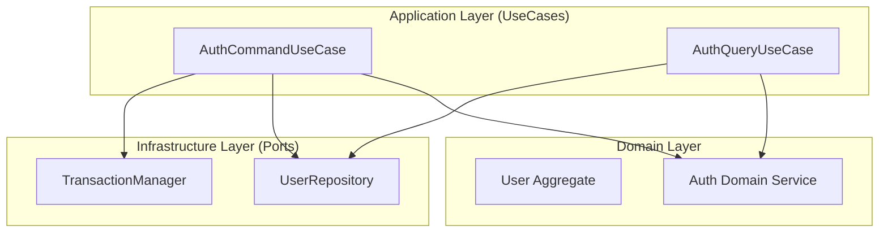
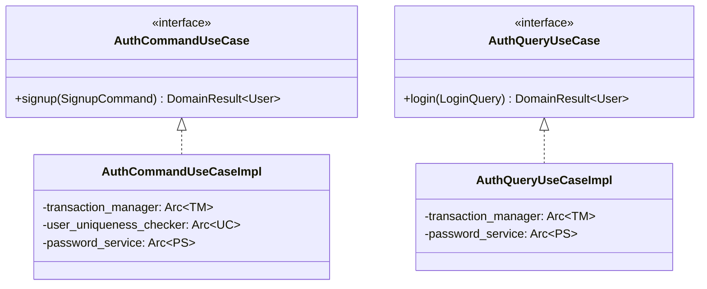

# 設計: AuthUseCase の CQRS パターン適用

## 概要
保守性と拡張性を向上させるため、`AuthUseCase` を CQRS（コマンドクエリ責務分離）パターンを用いて再構築します。これにより、状態を変更する操作（コマンド）と、データを取得する操作（クエリ）を分離します。

## アーキテクチャ図

### クラス図

## 変更内容
- `AuthUseCase` を `AuthCommandUseCase` と `AuthQueryUseCase` に分割。
- `LoginCommand` を `LoginQuery` にリネーム（CQRS の性質を反映）。
- ファイル構成をモジュール化: `libs/domain/src/usecase/auth/mod.rs`, `command.rs`, `query.rs`。
