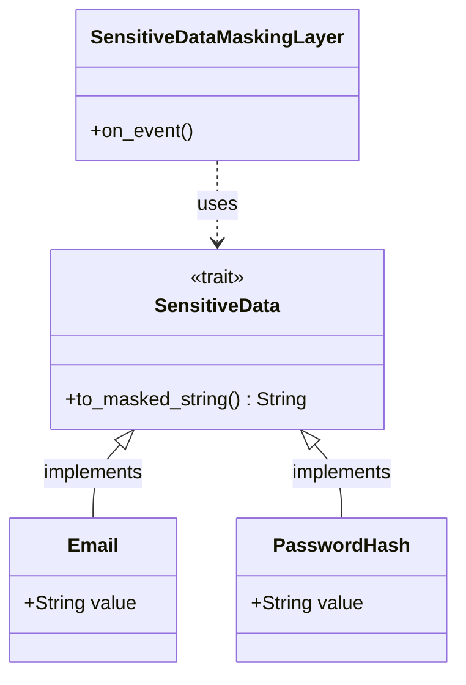

# 設計書: Tracing Sensitive Data Protection & Masking

## 1. 目的
システムの観測性を維持しつつ、ログやトレースに含まれる機密情報（個人情報(PII)、認証資格情報(Credentials)等）を自動的に保護する。開発環境ではデバッグのために詳細な情報を保持でき、本番環境では確実に秘匿される柔軟な仕組み（ハイブリッドアプローチ）を提供する。

## 2. アーキテクチャ概要

### 2.1 ハイブリッドアプローチの構造
1.  **ドメイン層 (識別):**
    - `SensitiveData` トレイトを定義し、機密情報を含む型（`Email`, `PasswordHash` 等）に実装する。
2.  **インフラ層 (実行):**
    - `SensitiveDataMaskingLayer` (tracing-subscriber) を実装する。
    - イベントの属性をスキャンし、`SensitiveData` な値や特定のフィールド名をマスキングする。
3.  **グローバル制御:**
    - 設定ファイル（`config`）により、マスキングの有効/無効を切り替える。

### 2.2 クラス図 (Mermaid)

## 3. 詳細設計

### 3.1 部分隠蔽ロジック
- **Email (`mask_email`):** `test@example.com` -> `t***@example.com` (ドメインと先頭1文字を維持)
- **Generic (`mask_generic`):** 最初と最後の数文字を残し、中間を `***` に置き換える。パスワードハッシュやトークンに使用。
- **短すぎる文字列:** 3文字以下の場合は、すべての文字を `*` に置き換える。

### 3.2 マスキングの優先順位
1.  値が `SensitiveData` トレイトを実装している場合、その `to_masked_string()` を使用する。
2.  フィールド名が既知のキーワード（`email`, `password`, `token`, `secret`, `authorization`）に一致する場合、文字列としてマスキングを適用する。

## 4. 考慮事項
- **パフォーマンス:** 毎回のログ出力で文字列走査が発生するため、フィールド名の比較は高速なハッシュセットや静的配列を使用する。
- **用語の定義:** PII（個人情報）に限定せず、ハッシュ値やトークンなどの「機密情報（Sensitive Data）」全般を対象とする。
