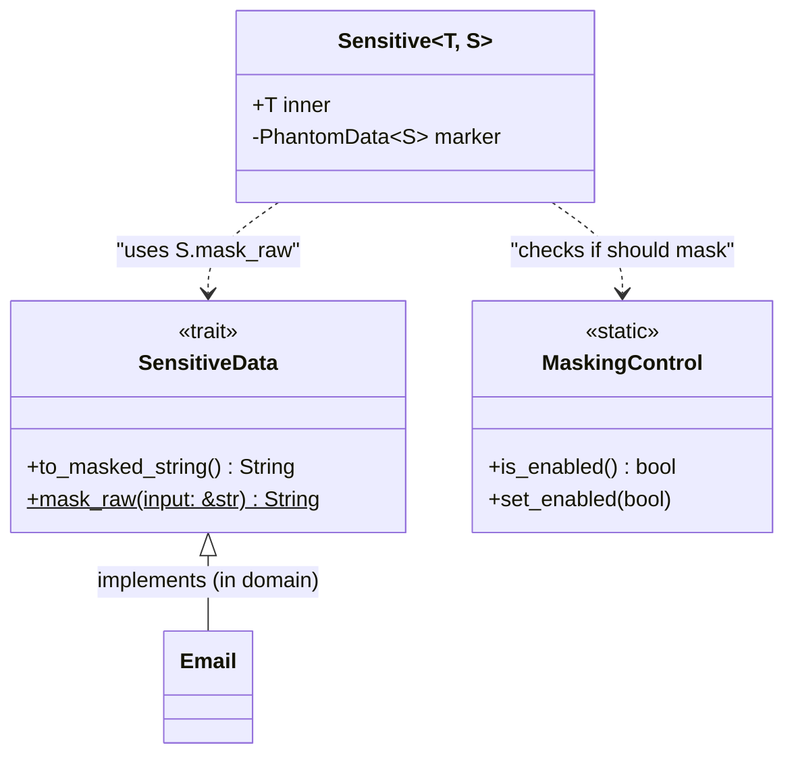

# 設計書: Tracing Sensitive Data Protection & Masking

## 1. 目的
システムの観測性を維持しつつ、機密情報を多層的に保護する。実装レベルでの「静的保護」と、環境に応じた「動的制御」を組み合わせたハイブリッドアプローチを実現する。

## 2. アーキテクチャ概要

### 2.1 独立クレート `libs/sensitive_data`
機密情報の扱いに関する「ポリシー（ルール）」と「構造（ラッパー）」をドメインロジックから分離し、全レイヤーで再利用可能にする。

### 2.2 ハイブリッドアプローチの仕組み
1.  **静的（型による定義）:**
    - `SensitiveData` トレイトを実装した型や `Sensitive<T, S>` ラッパーにより、「どのデータが機密か」をコード上で明示する。
2.  **動的（設定による制御）:**
    - グローバルな `MASK_SENSITIVE_DATA` フラグ（アトミックな静的変数等）を導入。
    - `Debug` 実装や `MaskingFormatter` は、出力時にこのフラグを参照し、`true` ならマスク後の値を、`false` なら生の値をそのまま出力する。

### 2.3 クラス図 (Mermaid)


## 3. 詳細設計

### 3.1 マスキングの動的切替
`libs/sensitive_data` に、マスキングの有無を管理するグローバルな状態（または設定参照メカニズム）を導入する。
```rust
pub fn should_mask() -> bool {
    // 1. 本番環境なら強制的に true
    // 2. それ以外は設定値（config）を参照
}
```

### 3.2 隠蔽ルールのマーカー型
- `EmailRule`: メールアドレス用の隠蔽。
- `PlainRule`: 汎用的な（最初と最後だけ残す）隠蔽。
- `SecretRule`: 完全に隠す（`***`）隠蔽。

## 4. 依存関係の整理
- `libs/sensitive_data`: 依存なし（serde, once_cell程度）。
- `libs/domain`: `libs/sensitive_data` に依存。
- `apps/api`: `libs/sensitive_data` に依存（`domain` には DTO 定義のためには依存しない）。
