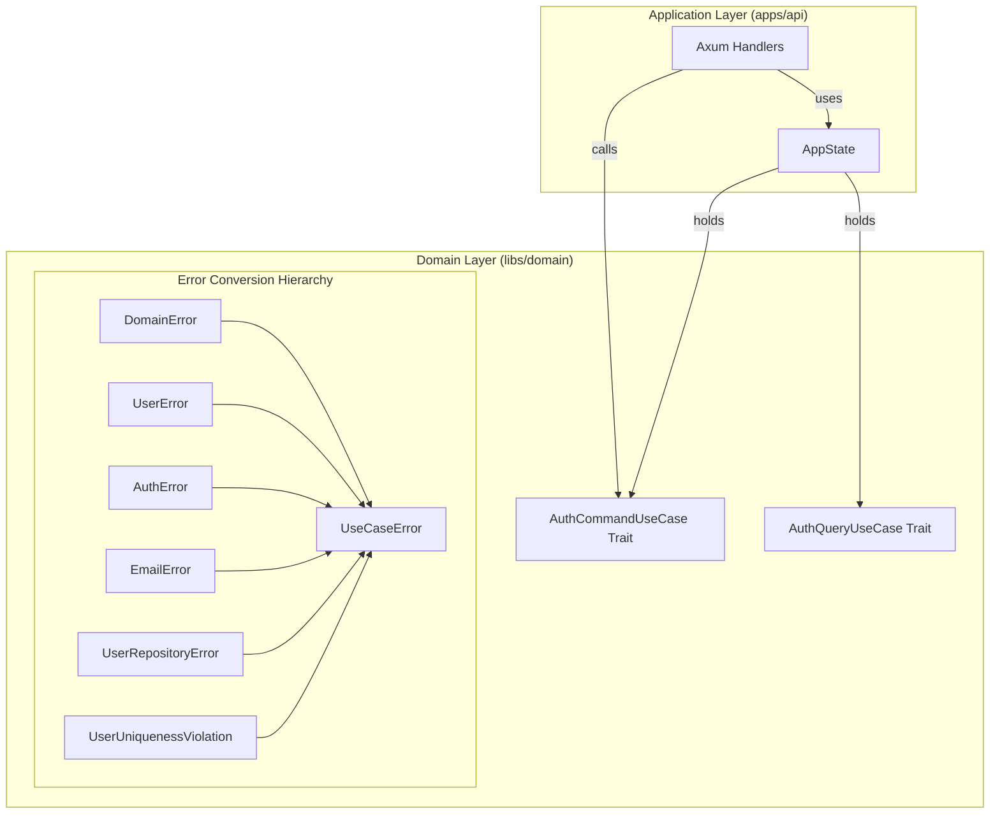

# 設計: Axum による Web API 実装と UseCaseError の導入

## 概要
`apps/api` において Axum ハンドラーを実装し、ドメインロジックを公開します。
ドメイン層内部のエラー（`DomainError`）をアプリケーション層の関心事に変換するため、階層的な `From` 実装を持つ `UseCaseError` を導入します。
また、Axum の `State` を利用して UseCase トレイトを注入する DI 構造を構築します。

## アーキテクチャ

## 実装方針

### 1. Axum State による依存注入 (DI)
- **AppState**: `Arc<dyn AuthCommandUseCase>` および `Arc<dyn AuthQueryUseCase>` を保持します。
- **トレイトの活用**: ハンドラーは具体的な実装クラス（インフラ層）を知らず、ドメイン層で定義されたトレイトにのみ依存します。

### 2. `UseCaseError` の定義と階層的変換
- **エラーバリアント**:
    - `InvalidInput`: バリデーションエラー（400 Bad Request）
    - `Authentication`: 認証失敗（401 Unauthorized）
    - `Forbidden`: 権限不足（403 Forbidden）
    - `NotFound`: リソース未発見（404 Not Found）
    - `Conflict`: 競合・重複（409 Conflict）
    - `Internal`: 予期せぬシステムエラー（500 Internal Server Error）
- **階層的 `From` 実装**:
    - 巨大な単一の `match` 文を避け、ドメインの各階層のエラー型（`DomainError`, `UserError`, `EmailError` 等）ごとに `From<T> for UseCaseError` を実装します。
    - これにより、UseCase 実装内で `?` 演算子を使用する際、各階層で定義された適切なアプリケーションエラーへと自動的に変換されます。

## API エンドポイント定義

| メソッド | パス | 対応 UseCase | 期待されるレスポンス |
| :--- | :--- | :--- | :--- |
| `POST` | `/api/v1/auth/signup` | `AuthCommandUseCase::signup` | 201 Created / 400 / 409 |
| `POST` | `/api/v1/auth/login` | `AuthQueryUseCase::login` | 200 OK (JWT) / 401 |
| `GET` | `/api/v1/users/me` | `AuthQueryUseCase::get_current_user` | 200 OK / 401 / 404 |
