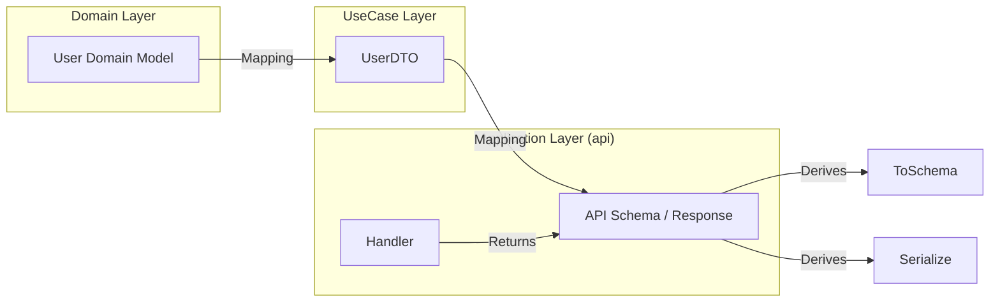

# 設計: レイヤー間 DTO 変換と OpenAPI ドキュメントの設定

## 概要
ドメインモデル、ユースケース DTO、および API スキーマを明確に分離します。各レイヤーの境界でデータを変換することで、ドメインの純粋性と API の柔軟性を両立させます。

## アーキテクチャとデータフロー

## 階層ごとのデータ構造

### 1. Domain Model (`libs/domain/src/models`)
- 業務知識と不変条件を保持。
- フレームワーク（utoipa等）に依存しない。

### 2. UseCase DTO (`libs/domain/src/usecase/dto`)
- ユースケースの結果を運搬するための純粋なデータ構造（Plain Data）。
- 外部レイヤーにドメインモデルを直接露出させないための防波堤。

### 3. API Schema (`apps/api/src/schemas`)
- クライアントに返す JSON の構造を定義。
- `utoipa::ToSchema` や `serde::Serialize` を導出。
- 必要に応じてフィールド名のキャメルケース化などのプレゼンテーション調整を行う。

## 実装手順

1. **UseCase DTO の定義**: `libs/domain/src/usecase/auth/dto.rs` を作成。
2. **UseCase 実装の変更**: `User` ではなく `UserDTO` を返すように変更。
3. **API Schema の定義**: `apps/api/src/schemas/auth.rs` を作成。
4. **ハンドラーの修正**: `UserDTO` を `UserResponse` に変換して返す。
5. **utoipa の構成**: API 全体のスキーマを `utoipa` に登録し、Swagger UI を表示する。

## メリット
- **疎結合**: API の変更がドメインに影響を与えず、ドメインの変更も DTO 変換層で吸収できる。
- **セキュリティ**: パスワードハッシュなどの内部情報を誤って API に露出させるリスクを物理的に排除する。
