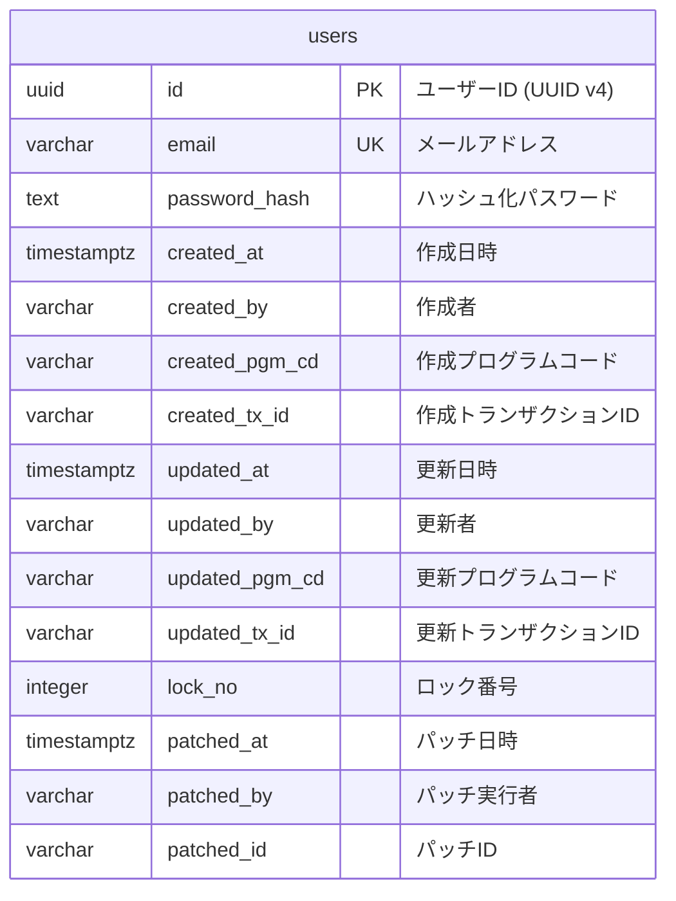

# 設計: DB スキーマ設計 (users テーブル)

## 概要
ユーザー情報を永続化するための `users` テーブルを設計します。ドメイン層の `User` モデルを保存するカラムに加え、プロダクトガイドラインに基づいた「共通カラム」を全て付与します。

## エンティティ図

## テーブル定義詳細

### users テーブル

| 分類 | カラム名 | 型 | 制約 | 説明 |
| :--- | :--- | :--- | :--- | :--- |
| 主キー | `id` | `UUID` | PRIMARY KEY | ユーザーの一意な識別子 |
| 業務 | `email` | `VARCHAR(255)` | NOT NULL | メールアドレス (UNIQUE INDEX を付与) |
| 業務 | `password_hash` | `TEXT` | NOT NULL | ハッシュ化パスワード |
| 共通(作成) | `created_at` | `TIMESTAMPTZ` | NOT NULL | 作成日時 |
| 共通(作成) | `created_by` | `VARCHAR(255)` | NOT NULL | 作成者 |
| 共通(作成) | `created_pgm_cd` | `VARCHAR(255)` | NOT NULL | 作成プログラムコード |
| 共通(作成) | `created_tx_id` | `VARCHAR(255)` | NOT NULL | 作成トランザクションID |
| 共通(更新) | `updated_at` | `TIMESTAMPTZ` | NOT NULL | 更新日時 |
| 共通(更新) | `updated_by` | `VARCHAR(255)` | NOT NULL | 更新者 |
| 共通(更新) | `updated_pgm_cd` | `VARCHAR(255)` | NOT NULL | 更新プログラムコード |
| 共通(更新) | `updated_tx_id` | `VARCHAR(255)` | NOT NULL | 更新トランザクションID |
| 共通(排他) | `lock_no` | `INTEGER` | NOT NULL, DEFAULT 1 | ロック番号 |
| 共通(パッチ) | `patched_at` | `TIMESTAMPTZ` | | パッチ日時 |
| 共通(パッチ) | `patched_by` | `VARCHAR(255)` | | パッチ実行者 |
| 共通(パッチ) | `patched_id` | `VARCHAR(255)` | | パッチID |

## マイグレーション方針
- `sqlx-cli` を使用して `.sql` ファイルを生成します。
- 全ての共通カラムを、ガイドラインの定義に従って付与します。
- パッチ系カラム（`patched_xxx`）はデフォルトで `NULL` を許容します。
