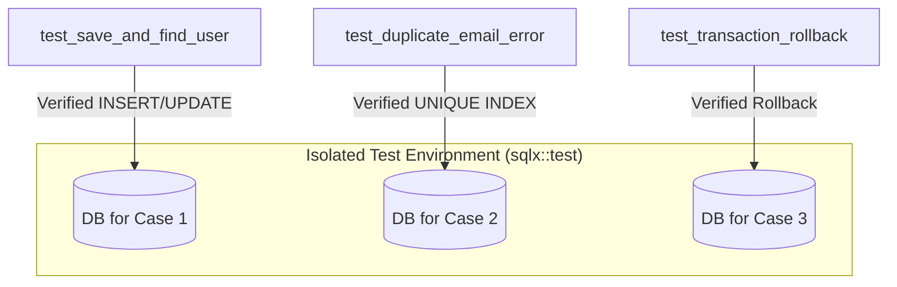

# 設計: リポジトリおよびトランザクションの統合テスト

## 概要
SQLx を用いた `UserRepository` および `SqlxTransactionManager` の実装が、実際の PostgreSQL データベースに対して正しく動作することを検証します。

## テスト戦略

### 1. 実行環境
- `sqlx::test` マクロを活用し、テスト実行ごとに**完全に独立した一時データベース**を自動生成します。
- テスト実行前に `migrations` ディレクトリのマイグレーションが自動的に適用されます。
- テスト終了後はデータベースが自動的にクリーンアップされるため、他のテストケースとのデータ競合が発生しません。

### 2. 検証項目
- **基本操作:** ユーザーの保存（INSERT/UPDATE）とメールアドレスによる検索が正しく行えること。
    - `ON CONFLICT` による既存レコードの更新ロジックも検証対象に含めます。
- **一意性制約:** 別のIDで同じメールアドレスを保存しようとした際に、UNIQUE INDEX により `QueryFailed` エラーが発生すること。
- **トランザクション境界:**
    - `Ok` を返した場合にデータがコミットされること。
    - `Err` を返した場合にデータがロールバックされること。
- **共通カラム:** 保存時に `created_at`, `lock_no` などが適切に処理されること（実装詳細はリポジトリに隠蔽）。

## 実装方針
- `libs/infrastructure/src/repository/tests.rs` に統合テストを記述します。
- `#[sqlx::test(migrations = "../../migrations")]` アノテーションを使用します。

## テストケース一覧 (Mermaid)

