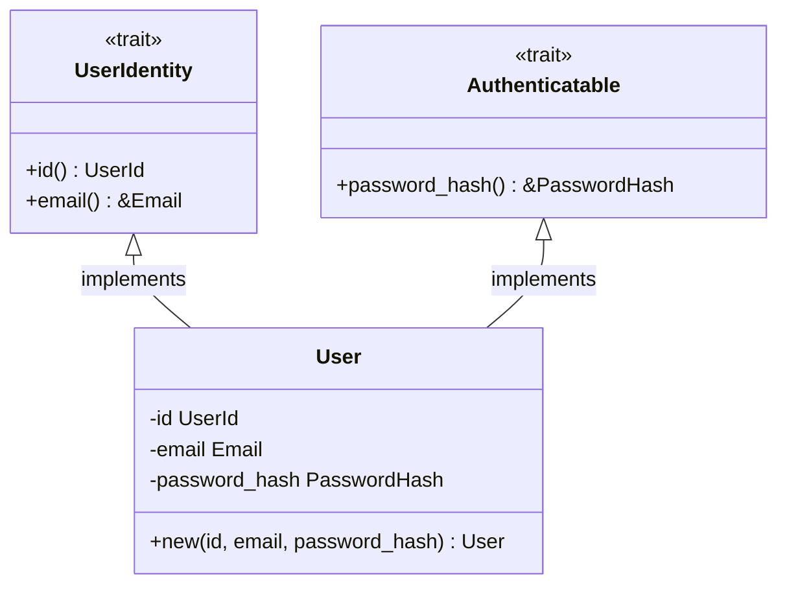

# 設計: User モデルのカプセル化とトレイトによる抽象化

## 概要
DMMF の原則に基づき、`User` モデルのフィールドをカプセル化すると同時に、将来的な状態（State）ごとの型定義を見据えて `trait` による抽象化を導入します。

## クラス図 (設計イメージ)

## 導入するトレイト

### 1. `UserIdentity`
識別子としての性質を定義します。将来的に `UnverifiedUser` や `DeletedUser` が導入されても、これらを共通して扱うために使用します。

### 2. `Authenticatable`
認証に使用可能な（パスワードハッシュを保持している）性質を定義します。

## 変更内容
- `libs/domain/src/models/user/mod.rs` にトレイトを定義。
- `User` 構造体のフィールドを非公開化。
- `User::new()` コンストラクタを追加。
- 既存の UseCase やテストにおけるフィールドへの直接アクセスを、トレイトのメソッド経由に修正。

## メリット
- **状態の導入が容易**: `ActiveUser` や `SuspendedUser` などの型を増やしても、トレイトを介して共通ロジックを維持できる。
- **不変条件の保護**: `pub` フィールドを廃止することで、コンストラクタ以外での不正な生成や編集を防止できる。
