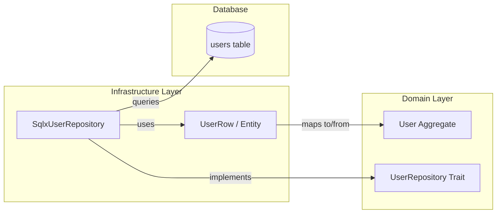

# 設計: UserRepository のアダプター実装 (SQLx)

## 概要
`libs/domain` で定義された `UserRepository` トレイトを、SQLx を用いて `libs/infrastructure` で実装します。プロダクトガイドラインに基づき、共通カラムの管理をインフラ層で行いつつ、ドメインモデルの純粋性を維持します。

## アーキテクチャ

## 実装方針

### 1. データモデルの分離
- **ドメインモデル (`User`):** `id`, `email`, `password_hash` のみ。
- **DBモデル (`UserRow`):** `sqlx::FromRow` を実装し、共通カラム（`created_at`, `lock_no` 等）を全て含む構造体。

### 2. 共通カラムの管理
- `INSERT` 時: `created_at`, `updated_at` に現在時刻を、`created_by`, `updated_by` に実行コンテキスト（今回は簡易化のため固定値 "system" またはメタデータ）を設定。`lock_no` は 1 で初期化。
- `UPDATE` 時: `updated_at`, `updated_by` を更新し、`lock_no` をインクリメント。SQL の `WHERE` 句に `lock_no = ?` を含めることで楽観ロックを実現。

### 3. トランザクション
- `libs/domain` の `TransactionManager` 実装と連携し、SQLx の `Pool` または `Transaction` を適切にハンドリングします。

## 構成ファイル
- `libs/infrastructure/src/repository/user.rs`: `UserRepository` の実実装。
- `libs/infrastructure/src/repository/mod.rs`: モジュールの公開。
